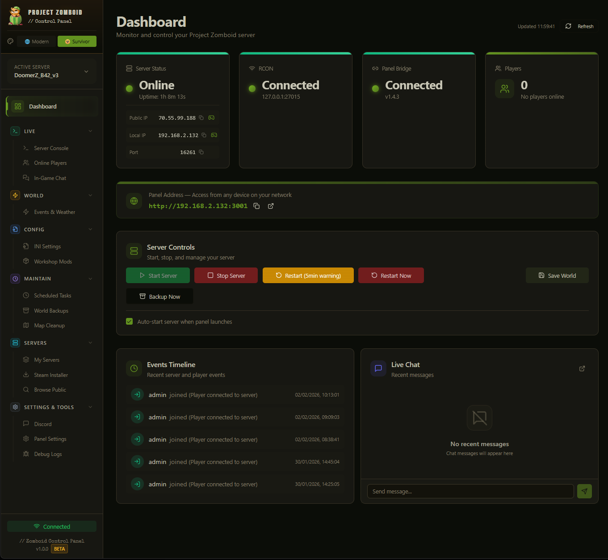

# Zomboid Control Panel

> ⚠️ **ALPHA RELEASE** - This software is in early development. Expect bugs and breaking changes.

A web-based management panel for Project Zomboid dedicated servers on Windows.



## Quick Start

**Option 1: Standalone Executable (Recommended)**
- Just double-click `ZomboidControlPanel.exe` - no installation needed!

**Option 2: Development Mode**
- Double-click `Start.bat` (requires Node.js)

The launcher will:
- ✅ Check if Node.js is installed (for dev mode)
- ✅ Install all dependencies automatically (first run only)
- ✅ Start the backend and frontend servers
- ✅ Open your browser to the panel

## Alternative Launchers

| File | Description |
|------|-------------|
| `ZomboidControlPanel.exe` | Standalone executable - No Node.js needed |
| `Start.bat` | Development mode - Best for development |
| `Start-Production.bat` | Production mode - Faster, single server |
| `install.bat` | Manual dependency installation |

## Features

- 🎮 **Server Control** - Start, stop, restart, and save your server
- 👥 **Player Management** - View online players, kick, ban, set access levels
- 📤 **Character Export/Import** - Export and import player XP, perks, skills, recipes
- 💬 **RCON Console** - Execute commands with a real-time terminal interface
- 📦 **Mod Manager** - Track Steam Workshop mods and auto-detect updates
- ⏰ **Scheduler** - Schedule automatic restarts and recurring tasks
- 🔄 **Auto-Restart on Mod Update** - Automatically restart when mods are updated
- 🌧️ **Weather Control** - Change weather conditions in-game
- 🧟 **Event Triggers** - Start helicopter events, hordes, and other game events
- 🤖 **Discord Bot** - Manage your server from Discord
- 🗑️ **Chunk Cleaner** - Remove old/unused chunks to reduce save size
- 🔌 **PanelBridge** - Server-side Lua script for advanced features (not a mod!)
- 🌐 **Network Configuration** - Configure server port and UPnP settings
- 🖥️ **Multi-Server Support** - Manage multiple PZ servers from one panel

## Requirements

### For Standalone Executable
- Windows 10/11
- A Project Zomboid dedicated server with RCON enabled

### For Development Mode
- Node.js 18+ (download from https://nodejs.org/)
- A Project Zomboid dedicated server with RCON enabled
- Windows OS

## First Time Setup

1. **Run the panel** - Double-click `ZomboidControlPanel.exe` (or `Start.bat` for dev mode)
2. **Configure your server** in the Settings page:
   - Set RCON password (must match your server's INI file)
   - Set server paths
3. **Install PanelBridge** (optional but recommended):
   - Go to **Settings** → **Panel Bridge (Advanced)** section
   - Click **"Install to Active Server"** for automatic installation
   - Make sure `DoLuaChecksum=false` is set in your server's .ini file
   - This enables advanced features like player teleporting, character export/import, and more

## PanelBridge Installation

**PanelBridge is NOT a workshop mod** - it's a Lua script that runs directly on your server.

### Features enabled by PanelBridge:
- **Player Management**: Teleport players, view detailed stats, heal players
- **Character Export/Import**: Backup and restore player XP, perks, skills, and recipes
- **World Control**: Set time, weather effects, spawn items/vehicles
- **Server Info**: Get detailed server status, player lists with positions

### Installing PanelBridge (Recommended Method)

1. Open the panel and go to **Settings**
2. Scroll to **Panel Bridge (Advanced)** section
3. Click **"Auto-Configure from Active Server"** or enter your server name
4. Click **"Install to Active Server"** - this copies PanelBridge.lua automatically
5. Set `DoLuaChecksum=false` in your server's `.ini` file (REQUIRED)
6. Restart your PZ server

### Manual Installation (Alternative)

Copy `pz-mod/PanelBridge/media/lua/server/PanelBridge.lua` to:
```
YOUR_SERVER_INSTALL_PATH/media/lua/server/PanelBridge.lua
```

⚠️ **Important:**
- Do NOT add PanelBridge to your `Mods=` line - it's not a mod!
- Re-deploy PanelBridge after game updates (updates may overwrite the lua folder)

## Project Structure

```
Dev1/
├── server/
│   ├── index.js           # Express server entry point
│   ├── database/
│   │   └── init.js        # SQLite database setup
│   ├── routes/
│   │   ├── server.js      # Server control endpoints
│   │   ├── players.js     # Player management endpoints
│   │   ├── rcon.js        # RCON command endpoints
│   │   ├── scheduler.js   # Task scheduling endpoints
│   │   ├── mods.js        # Mod tracking endpoints
│   │   └── config.js      # Settings endpoints
│   ├── services/
│   │   ├── rcon.js        # RCON connection service
│   │   ├── serverManager.js  # Server process management
│   │   ├── modChecker.js  # Steam Workshop API integration
│   │   └── scheduler.js   # Cron job management
│   └── utils/
│       ├── logger.js      # Winston logger
│       └── commands.js    # PZ command definitions
├── client/
│   ├── src/
│   │   ├── components/    # React UI components
│   │   ├── pages/         # Page components
│   │   ├── lib/           # API client & utilities
│   │   └── contexts/      # React contexts
│   └── ...
├── data/                  # SQLite database (created at runtime)
└── logs/                  # Application logs
```

## Troubleshooting

### Can't connect to RCON
1. Make sure your PZ server is running
2. Verify RCON is enabled in your server's .ini file
3. Check that the port isn't blocked by a firewall
4. Ensure the password matches exactly

### PanelBridge not working
1. Verify `PanelBridge.lua` is in your server's `media/lua/server/` folder
2. Make sure `DoLuaChecksum=false` is set in your server's .ini file
3. Restart the PZ server after installing PanelBridge
4. Check the panel's Debug page for PanelBridge status

### Mod updates not detecting
1. Verify your Steam Web API key if using one
2. Check that mod Workshop IDs are correct
3. Try syncing mods from server configuration

### Server won't start/stop
1. Make sure SERVER_PATH points to the correct folder
2. Run the panel as Administrator if needed
3. Check Windows Task Manager for zombie processes

### Character export/import issues
1. Make sure PanelBridge mod is installed and running
2. Player must be online for export/import to work
3. Check the panel logs for specific error messages

## License

MIT License - Feel free to modify and use as needed.

---

## Disclaimer

This project was created with the assistance of **Claude Opus** (Anthropic) and **Visual Studio Code** with GitHub Copilot.

---

## Disclaimer

This project was created with the assistance of **Claude Opus** (Anthropic) and **Visual Studio Code** with GitHub Copilot.
